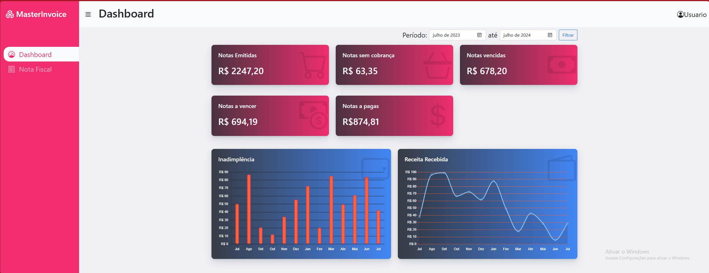
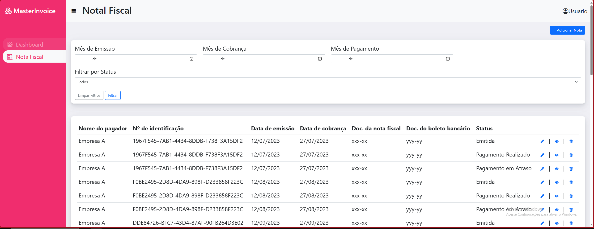

# MasterInvoice
 # Projeto TechNation - Sistema Financeiro

Este projeto é um sistema financeiro desenvolvido como parte do teste técnico da TechNation para avaliação de habilidades Fullstack.

## Capturas de Tela

## Tecnologias Utilizadas

- Frontend: HTML, CSS, JavaScript, jQuery, Bootstrap, chat.js para gráficos
- Backend: C#, .NET LTS, SQL Server

## Instalação e Configuração

1. Clone o repositório.
2. Instale as dependências do frontend com `npm install`.
3. Configure o banco de dados SQL Server conforme `SQL/`.
4.  Execute o backend e o frontend.

## Estrutura de Diretórios

- `backend/`: Contém o código do backend em C#.
- `frontend/`: Contém o código do frontend em HTML, CSS, JS.

## Contato

Para mais informações, entre em contato através de [luiznetosilva@hotmail.com](mailto:luiznetosilva@hotmail.com).

## Correções
 Alterar cards do dashboard
 Melhor desempenho reuicição do dashboard 
 ALterar DOCK
